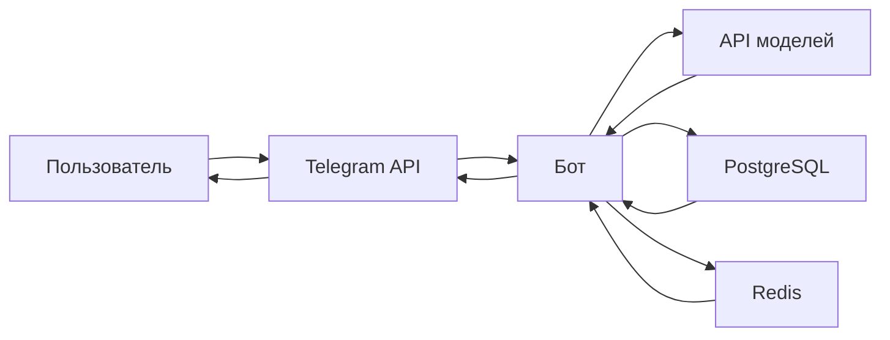

# Архитектура NodeX.ai

Обзор технической архитектуры проекта NodeX.ai.

## Общая схема

## Компоненты схемы

### 1. Пользователь
- Отправляет и получает сообщения

### 2. Telegram API
- Позволяет боту взаимодействовать с Telegram

### 3. NodeX.ai
- Сохраняет и удаляет пользователя из базы данных
- Очищает историю сообщений
- Обрабатывает команды и коллбеки
- Сохраняет сообщения в базе данных
- Обрабатывает ответы моделей
- Отправляет текстовые сообщения пользователя нейросети
- Шифрование сообщений пользователя и ответов нейросети

### 4. API моделей
- Принимает запрос от NodeX.ai
- Обрабатывает запрос
- Отправляет ответ NodeX.ai

### 5. PostgreSQL
- Сохранение, обновление, удаление пользователей
- Сохранение, удаление, передача истории сообщений боту
- Передача статистики боту

### 6. Redis
- Ограничение спама командами
- Ограничение спама коллбеками
- Блокирование пользователя до тех пор, пока нейросеть не обработает заданный запрос

## Структура базы данных

### Таблица пользователей:

| Поле |	Тип |	Описание |
|------|--------|-------------|
| telegram_id |	BIGINT	| Уникальный ID пользователя в Telegram
| current_model |	VARCHAR	| Выбранная тектовая модель ИИ
| image_model | VARCHAR | Выбранная модель для распознавания изображений
| created_at |	TIMESTAMP	|Дата регистрации

### Таблица сообщений:

| Поле | Тип	| Описание |
|-----|------|-----|
| id	|BIGSERIAL	| Уникальный ID сообщения
| user_id	|BIGINT	|Ссылка на пользователя|
| message_text|	TEXT     |Текст запроса пользователя|
| ai_response|    TEXT   |Ответ нейросети |
| model_used |  VARCHAR  | Использованная модель ИИ |
| created_at | TIMESTAMP | Время создания записи |

